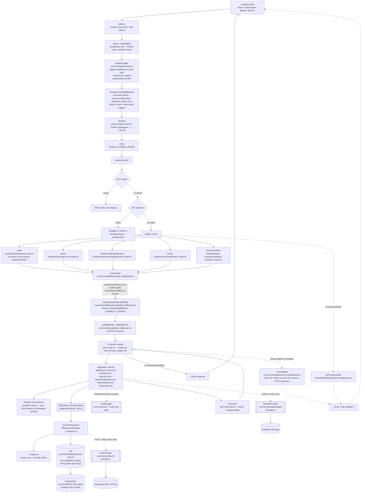

# LLD — Backend Request Lifecycle (Whole-System)

The full path of one HTTP request through `needleye-api`, from `index.ts` to
the response: the middleware chain, a module's Controller → Service → Domain
rules/Repository Port → Infrastructure → Postgres, back out through the
Presenter, and the error-handling path.

