# LLD — Class Diagram

Every class, interface, and rule/presenter function in `needleye-api`, grouped
by module, with each node labeled with its real file path. Shows
implements/extends relationships, Service → Repository Port dependencies, and
the cross-module Infrastructure-to-Infrastructure schema reads documented in
`docs/adr/0003-per-module-schema-ownership.md`.

```mermaid
classDiagram
    direction TB

    namespace Common {
        class AuthProvider["AuthProvider (common/auth/auth-provider.ts)"] {
            <<interface>>
            +signInWithPassword(email, password) AuthSession
            +refreshSession(refreshToken) AuthSession
            +signOut(accessToken) void
            +verifyAccessToken(token) userId
            +requestPasswordReset(email, redirectTo) void
            +setPassword(userId, newPassword) void
            +exchangeCodeForSession(code) AuthSession
            +mintSessionForUser(email) AuthSession
            +createUser(user) userId
            +banUser(userId) void
        }
        class SupabaseAuthProvider["SupabaseAuthProvider (common/auth/supabase-auth-provider.ts)"]

        class StorageProvider["StorageProvider (common/storage/storage-provider.ts)"] {
            <<interface>>
            +upload(orderId, slot, file) storagePath
            +getSignedUrl(storagePath) url
            +delete(storagePath) void
        }
        class SupabaseStorageProvider["SupabaseStorageProvider (common/storage/supabase-storage-provider.ts)"]

        class AppError["AppError (common/errors/app-error.ts)"] {
            +statusCode number
            +code string
            +details unknown
            +cause unknown
        }
        class BadRequestError["BadRequestError (400)"]
        class UnauthorizedError["UnauthorizedError (401)"]
        class ForbiddenError["ForbiddenError (403)"]
        class NotFoundError["NotFoundError (404)"]
        class ConflictError["ConflictError (409)"]
        class InternalError["InternalError (500)"]

        class requireAuth["requireAuth (common/middleware/auth.middleware.ts)"]
        class requireCapability["requireCapability(capability) (common/middleware/capability.middleware.ts)"]
        class fetchActiveProfile["fetchActiveProfile(userId) (common/database/profiles.ts)"]
    }

    namespace SharedKernel {
        class Profile["Profile (domain/profile.ts)"] {
            <<interface>>
            +id string
            +fullName string
            +email string
            +role Role
            +active boolean
            +createdAt string
        }
        class capabilities["capabilities.ts (domain/capabilities.ts)"] {
            +getCapabilityScope(role, capability) CapabilityScope
            +hasCapability(role, capability) boolean
            +isScopedToOwnRecords(role, capability) boolean
        }
    }

    namespace ModuleAuth {
        class AuthRepositoryPort["AuthRepositoryPort (application/ports/auth-repository.port.ts)"] {
            <<interface>>
            +countOwnerManagers() number
            +createOwnerManagerUser(dto) void
            +signInWithPassword(email, password) AuthSession
            +refreshSession(refreshToken) AuthSession
            +signOut(accessToken) void
            +requestPasswordReset(email, redirectTo) void
            +updatePassword(userId, newPassword) void
            +exchangeCodeForSession(code) AuthSession
            +getProfile(userId) Profile
            +signInWithQrToken(token) AuthSession
            +recordLogin(userId) void
        }
        class DrizzleAuthRepository["DrizzleAuthRepository (infrastructure/drizzle-auth.repository.ts)"]
        class AuthService["AuthService (application/auth.service.ts)"] {
            +getBootstrapStatus() ownerExists
            +bootstrap(dto) void
            +login(dto) AuthSessionResponseDto
            +qrLogin(dto) AuthSessionResponseDto
            +refresh(dto) AuthSessionResponseDto
            +logout(accessToken) void
            +requestPasswordReset(dto) void
            +updatePassword(userId, dto) void
            +exchangeCode(dto) AuthSessionResponseDto
            -withProfile(tokens) AuthSessionResponseDto
        }
        class bootstrap_rules["bootstrap.rules.ts (domain/bootstrap.rules.ts)"] {
            +assertNoOwnerManagerExists(count) void
        }
        class toAuthSessionResponseDto["toAuthSessionResponseDto(tokens, profile) (api/auth-session.presenter.ts)"]
        class qrLoginTokens["qr_login_tokens (infrastructure/qr-login.schema.ts)"] {
            <<Drizzle table>>
            +profileId uuid PK
            +tokenHash text
            +createdAt timestamp
        }
    }

    namespace ModuleUsers {
        class UsersRepositoryPort["UsersRepositoryPort (application/ports/users-repository.port.ts)"] {
            <<interface>>
            +findAll() UserAccountEntity[]
            +findById(id) UserAccountEntity
            +createUser(email, fullName, role, password) userId
            +updateProfile(id, updates) void
            +setPassword(id, password) void
            +setQrToken(profileId, tokenHash) void
            +clearQrToken(profileId) void
            +banAuthUser(id) void
        }
        class DrizzleUsersRepository["DrizzleUsersRepository (infrastructure/drizzle-users.repository.ts)"]
        class UsersService["UsersService (application/users.service.ts)"] {
            +listUsers() UserResponseDto[]
            +createUser(dto) userId, password
            +generatePassword(targetId) password
            +generateQrToken(targetId) token, loginUrl
            +updateUser(targetId, dto) void
            +deactivateUser(targetId, callerId) void
        }
        class UserAccountEntity["UserAccountEntity (domain/user-account.entity.ts)"]
        class account_credential_rules["account-credential.rules.ts (domain/account-credential.rules.ts)"] {
            +assertPasswordCanBeRegenerated(role, lastLoginAt) void
            +assertRoleSupportsQrLogin(role) void
        }
        class UserAccountMapper["UserAccountMapper (infrastructure/user-account.mapper.ts)"] {
            +toEntity(row) UserAccountEntity
        }
        class toUserResponseDto["toUserResponseDto(entity) (api/user.presenter.ts)"]
        class profiles["profiles (infrastructure/profile.schema.ts)"] {
            <<Drizzle table>>
            +id uuid PK
            +fullName text
            +email text
            +role text
            +active boolean
            +createdAt timestamp
            +updatedAt timestamp
            +lastLoginAt timestamp
        }
    }

    namespace ModuleTeamMembers {
        class TeamMembersRepositoryPort["TeamMembersRepositoryPort (application/ports/team-members-repository.port.ts)"] {
            <<interface>>
            +findActive(role) TeamMemberEntity[]
        }
        class DrizzleTeamMembersRepository["DrizzleTeamMembersRepository (infrastructure/drizzle-team-members.repository.ts)"]
        class TeamMembersService["TeamMembersService (application/team-members.service.ts)"] {
            +listActive(role) TeamMemberResponseDto[]
        }
        class TeamMemberEntity["TeamMemberEntity (domain/team-member.entity.ts)"] {
            +id string
            +fullName string
            +role Role
        }
        class toTeamMemberResponseDto["toTeamMemberResponseDto(entity) (api/team-member.presenter.ts)"]
    }

    namespace ModulePayments {
        class PaymentsRepositoryPort["PaymentsRepositoryPort (application/ports/payments-repository.port.ts)"] {
            <<interface>>
            +findOrderContext(orderId) OrderLedgerContext
            +findByOrderId(orderId) PaymentEntity[]
            +findById(orderId, paymentId) PaymentEntity
            +sumByOrderId(orderId) number
            +create(record) PaymentEntity
            +update(paymentId, data) PaymentEntity
            +delete(paymentId) void
        }
        class DrizzlePaymentsRepository["DrizzlePaymentsRepository (infrastructure/drizzle-payments.repository.ts)"]
        class PaymentsService["PaymentsService (application/payments.service.ts)"] {
            +listPayments(ctx, orderId) PaymentResponseDto[]
            +addPayment(ctx, orderId, dto) PaymentResponseDto
            +updatePayment(ctx, orderId, paymentId, dto) PaymentResponseDto
            +deletePayment(ctx, orderId, paymentId) void
            -loadOrderForAccess(ctx, orderId) OrderLedgerContext
        }
        class PaymentEntity["PaymentEntity (domain/payment.entity.ts)"]
        class OrderLedgerContext["OrderLedgerContext (domain/payment.entity.ts)"]
        class payment_ledger_rules["payment-ledger.rules.ts (domain/payment-ledger.rules.ts)"] {
            +roundCurrency(amount) number
            +assertLedgerReconciles(wouldBeSum, totalAmount, action) void
        }
        class PaymentsMapper["PaymentsMapper (infrastructure/payments.mapper.ts)"] {
            +toEntity(row) PaymentEntity
        }
        class toPaymentResponseDto["toPaymentResponseDto(entity) (api/payment.presenter.ts)"]
        class payments["payments (infrastructure/payments.schema.ts)"] {
            <<Drizzle table>>
            +id uuid PK
            +orderId uuid
            +amount numeric
            +method text
            +paidAt date
            +recordedBy uuid
            +notes text
            +createdAt timestamp
        }
    }

    namespace ModuleOrders {
        class OrdersRepositoryPort["OrdersRepositoryPort (application/ports/orders-repository.port.ts)"] {
            <<interface>>
            +findMany(scope, filters) OrderEntity[]
            +findById(scope, id) OrderEntity
            +findBasicById(id) OrderBasicInfo
            +create(data) OrderEntity
            +update(id, data) OrderEntity
            +upsertImage(data) void
            +findImage(orderId, slot) OrderImageInfo
            +deleteImage(orderId, slot) void
            +sumPaymentsForOrder(orderId) number
            +sumPaymentsForOrders(orderIds) map
        }
        class DrizzleOrdersRepository["DrizzleOrdersRepository (infrastructure/drizzle-orders.repository.ts)"] {
            -rowScopeCondition(scope) condition
            -findByIdUnscoped(id) OrderEntity
        }
        class OrdersService["OrdersService (application/orders.service.ts)"] {
            +listOrders(ctx, filters) OrderResponseDto[]
            +getOrder(ctx, orderId) OrderResponseDto
            +createOrder(ctx, dto) OrderResponseDto
            +updateOrder(ctx, orderId, dto) OrderResponseDto
            +uploadOrderImage(ctx, orderId, slot, file) storagePath, url
            +deleteOrderImage(ctx, orderId, slot) void
            -assertOrderEditable(ctx, orderId) void
        }
        class OrderEntity["OrderEntity (domain/order.entity.ts)"]
        class OrderImageEntity["OrderImageEntity (domain/order.entity.ts)"]
        class order_edit_rules["order-edit.rules.ts (domain/order-edit.rules.ts)"] {
            +assertFieldsEditable(role, submittedKeys) FieldEditDecision
            +assertOwnershipForScopedEdit(designerId, callerId) void
        }
        class order_ledger_rules["order-ledger.rules.ts (domain/order-ledger.rules.ts)"] {
            +assertOrderCanBeMarkedFullyPaid(paymentsSum, totalAmount) void
        }
        class order_visibility_rules["order-visibility.rules.ts (domain/order-visibility.rules.ts)"] {
            +canViewPaymentFields(role) boolean
        }
        class OrderMapper["OrderMapper (infrastructure/order.mapper.ts)"] {
            +toEntity(row) OrderEntity
        }
        class toOrderResponseDto["toOrderResponseDto(entity, amountPaid, role, storageProvider) (api/order.presenter.ts)"]
        class orders["orders (infrastructure/order.schema.ts)"] {
            <<Drizzle table>>
            +id uuid PK
            +orderNumber text
            +designerId uuid
            +masterTailorId uuid
            +paymentStatus text
            +totalAmount numeric
            +productionStatus text
        }
        class orderImages["order_images (infrastructure/order-image.schema.ts)"] {
            <<Drizzle table>>
            +id uuid PK
            +orderId uuid
            +slot smallint
            +storagePath text
        }
        class orderCounters["order_counters (infrastructure/order-counter.schema.ts)"] {
            <<Drizzle table>>
            +year int PK
            +nextSeq int
        }
        class order_relations["order.relations.ts (infrastructure/order.relations.ts)"] {
            +ordersRelations
            +orderImagesRelations
        }
    }

    %% -- Implementations / realizations --
    SupabaseAuthProvider ..|> AuthProvider
    SupabaseStorageProvider ..|> StorageProvider
    BadRequestError --|> AppError
    UnauthorizedError --|> AppError
    ForbiddenError --|> AppError
    NotFoundError --|> AppError
    ConflictError --|> AppError
    InternalError --|> AppError

    DrizzleAuthRepository ..|> AuthRepositoryPort
    DrizzleUsersRepository ..|> UsersRepositoryPort
    DrizzleTeamMembersRepository ..|> TeamMembersRepositoryPort
    DrizzlePaymentsRepository ..|> PaymentsRepositoryPort
    DrizzleOrdersRepository ..|> OrdersRepositoryPort

    %% -- Service depends on its own module's port --
    AuthService --> AuthRepositoryPort
    UsersService --> UsersRepositoryPort
    TeamMembersService --> TeamMembersRepositoryPort
    PaymentsService --> PaymentsRepositoryPort
    OrdersService --> OrdersRepositoryPort

    %% -- Service uses domain rules + presenter --
    AuthService ..> bootstrap_rules
    AuthService ..> toAuthSessionResponseDto
    UsersService ..> account_credential_rules
    UsersService ..> toUserResponseDto
    TeamMembersService ..> toTeamMemberResponseDto
    PaymentsService ..> payment_ledger_rules
    PaymentsService ..> toPaymentResponseDto
    OrdersService ..> order_edit_rules
    OrdersService ..> order_ledger_rules
    OrdersService ..> toOrderResponseDto
    OrdersService --> StorageProvider
    toOrderResponseDto ..> order_visibility_rules

    %% -- Repository depends on AuthProvider (identity ops) --
    DrizzleAuthRepository --> AuthProvider
    DrizzleUsersRepository --> AuthProvider

    %% -- Repository owns its module's schema --
    DrizzleAuthRepository --> qrLoginTokens
    DrizzleUsersRepository --> profiles
    DrizzlePaymentsRepository --> payments
    DrizzleOrdersRepository --> orders
    DrizzleOrdersRepository --> orderImages
    DrizzleOrdersRepository --> order_relations
    DrizzleOrdersRepository ..> orderCounters : never queried directly, backs DB trigger

    %% -- Mapper used by its module's repository --
    DrizzleUsersRepository ..> UserAccountMapper
    DrizzlePaymentsRepository ..> PaymentsMapper
    DrizzleOrdersRepository ..> OrderMapper
    UserAccountMapper ..> UserAccountEntity
    PaymentsMapper ..> PaymentEntity
    OrderMapper ..> OrderEntity

    %% -- Cross-module Infrastructure-to-Infrastructure reads (ADR 0003) --
    DrizzleAuthRepository ..> profiles : cross-module read/write
    DrizzleUsersRepository ..> qrLoginTokens : cross-module read/write
    DrizzleTeamMembersRepository ..> profiles : cross-module read
    DrizzlePaymentsRepository ..> orders : cross-module read
    DrizzlePaymentsRepository ..> profiles : cross-module read
    DrizzleOrdersRepository ..> payments : cross-module read
    order_relations ..> profiles : cross-module read

    %% -- Entity composition --
    OrderEntity --> OrderImageEntity
    PaymentEntity --> OrderLedgerContext
```

