# LLD — Database Flow (Repository Port → Drizzle → Postgres)

How a call travels from a module's Repository Port down to the actual
Postgres tables, including which module owns which schema file/table, the
cross-module Infrastructure-to-Infrastructure reads (see
`docs/adr/0003-per-module-schema-ownership.md`), and the two side-channels
(Supabase Auth, Supabase Storage) that deliberately bypass Drizzle entirely.

```mermaid
flowchart TD
    subgraph Services["Application Layer -- application/*.service.ts"]
        AuthSvc["AuthService"]
        UsersSvc["UsersService"]
        TeamSvc["TeamMembersService"]
        PaySvc["PaymentsService"]
        OrdSvc["OrdersService"]
    end

    subgraph Ports["Repository Ports (interfaces) -- application/ports/*.port.ts"]
        AuthPort[["AuthRepositoryPort"]]
        UsersPort[["UsersRepositoryPort"]]
        TeamPort[["TeamMembersRepositoryPort"]]
        PayPort[["PaymentsRepositoryPort"]]
        OrdPort[["OrdersRepositoryPort"]]
    end

    subgraph Repos["Concrete Adapters -- infrastructure/drizzle-*.repository.ts"]
        AuthRepo["DrizzleAuthRepository"]
        UsersRepo["DrizzleUsersRepository"]
        TeamRepo["DrizzleTeamMembersRepository"]
        PayRepo["DrizzlePaymentsRepository"]
        OrdRepo["DrizzleOrdersRepository"]
    end

    AuthSvc --> AuthPort --> AuthRepo
    UsersSvc --> UsersPort --> UsersRepo
    TeamSvc --> TeamPort --> TeamRepo
    PaySvc --> PayPort --> PayRepo
    OrdSvc --> OrdPort --> OrdRepo

    DB[("db<br/>common/database/drizzle-client.ts<br/>drizzle(pool, schema)")]
    AuthRepo --> DB
    UsersRepo --> DB
    TeamRepo --> DB
    PayRepo --> DB
    OrdRepo --> DB

    Pool[("pg.Pool<br/>DATABASE_URL")]
    DB --> Pool
    Postgres[("PostgreSQL<br/>local: Supabase CLI Docker stack<br/>prod: any Postgres host")]
    Pool --> Postgres

    subgraph SchemaFiles["Per-module infrastructure/*.schema.ts -- aggregated into one `schema` object"]
        SchProfiles["profiles<br/>modules/users/infrastructure/profile.schema.ts"]
        SchQr["qr_login_tokens<br/>modules/auth/infrastructure/qr-login.schema.ts"]
        SchPayments["payments<br/>modules/payments/infrastructure/payments.schema.ts"]
        SchOrders["orders<br/>modules/orders/infrastructure/order.schema.ts"]
        SchOrderImages["order_images<br/>modules/orders/infrastructure/order-image.schema.ts"]
        SchOrderCounters["order_counters<br/>modules/orders/infrastructure/order-counter.schema.ts"]
        SchRelations["order.relations.ts<br/>ordersRelations / orderImagesRelations"]
    end

    DB -.aggregates schema from.-> SchProfiles
    DB -.aggregates schema from.-> SchQr
    DB -.aggregates schema from.-> SchPayments
    DB -.aggregates schema from.-> SchOrders
    DB -.aggregates schema from.-> SchOrderImages
    DB -.aggregates schema from.-> SchOrderCounters
    DB -.aggregates schema from.-> SchRelations

    UsersRepo -->|owns| SchProfiles
    AuthRepo -->|owns| SchQr
    PayRepo -->|owns| SchPayments
    OrdRepo -->|owns| SchOrders
    OrdRepo -->|owns| SchOrderImages
    OrdRepo -.->|owns, never queried directly<br/>backs orders_set_order_number trigger| SchOrderCounters
    OrdRepo -->|owns, used for db.query relational API| SchRelations

    AuthRepo -.->|cross-module read/write<br/>ADR 0003| SchProfiles
    TeamRepo -.->|cross-module read<br/>ADR 0003| SchProfiles
    PayRepo -.->|cross-module read<br/>ADR 0003| SchProfiles
    SchRelations -.->|cross-module read<br/>ADR 0003| SchProfiles
    UsersRepo -.->|cross-module read/write<br/>ADR 0003| SchQr
    PayRepo -.->|cross-module read<br/>ADR 0003| SchOrders
    OrdRepo -.->|cross-module read<br/>ADR 0003| SchPayments

    SchProfiles --> PG_profiles[("Postgres table: profiles")]
    SchQr --> PG_qr[("Postgres table: qr_login_tokens")]
    SchPayments --> PG_payments[("Postgres table: payments")]
    SchOrders --> PG_orders[("Postgres table: orders")]
    SchOrderImages --> PG_orderImages[("Postgres table: order_images")]
    SchOrderCounters --> PG_orderCounters[("Postgres table: order_counters")]

    PG_profiles -.-> Postgres
    PG_qr -.-> Postgres
    PG_payments -.-> Postgres
    PG_orders -.-> Postgres
    PG_orderImages -.-> Postgres
    PG_orderCounters -.-> Postgres

    %% -- Side channels that bypass Drizzle entirely --
    AuthRepo --> AuthProviderIface[["AuthProvider<br/>common/auth/auth-provider.ts"]]
    UsersRepo --> AuthProviderIface
    AuthProviderIface --> SupaAuth[("Supabase Auth / GoTrue<br/>auth.users, RLS, handle_new_user() trigger<br/>NOT Drizzle-managed")]

    OrdSvc --> StorageProviderIface[["StorageProvider<br/>common/storage/storage-provider.ts"]]
    StorageProviderIface --> SupaStorage[("Supabase Storage<br/>order-images bucket<br/>NOT Drizzle-managed")]

    Migrations["supabase/migrations/*.sql<br/>Supabase CLI -- RLS, triggers, bucket, grants"] -.governs.-> SupaAuth
    Migrations -.governs.-> SupaStorage
    DrizzleKit["drizzle-kit generate / migrate<br/>drizzle.config.ts glob: modules/*/infrastructure/*.schema.ts"] -.governs.-> Postgres
```

